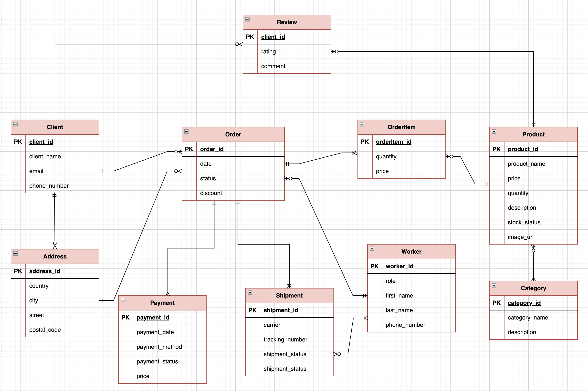

Цей проєкт моделює систему для електронної комерції, яка має на меті обслуговування онлайн-магазину з продажу товарів. Основними зацікавленими сторонами є:

-Адміністратор магазину — потребує інструментів для керування товарами, категоріями, запасами та відстеження замовлень.

-Клієнт — повинен мати змогу робити замовлення, переглядати товари та історію замовлень.

-Система — має зберігати інформацію про замовлення, платежі, доставку тощо.

Основні бізнес-правила:

- Кожен клієнт може зробити багато замовлень.
- Замовлення може містити кілька товарів різної категорії.
- Кожен товар належить до однієї або декількох категорій(наприклад: клавіатура може входити до категорії "Аксесуари для комп'ютера", "Бездротові пристрої").
- Для кожного замовлення зберігається адреса доставки.
- Кожен клієнт може мати одну або декілька адрес доставки
- Кожне замовлення пов'язане з одним платежем і однією доставкою.

Діаграма ER

Сутності:

1. Address (Адреса)

- address_id (PK)
- country
- city
- street
- postal_code

2. Client (Клієнт)

- client_id (PK)
- client_name
- email
- phone_number (не більше 13 символів)
  Зв'язки:
  до adress_id, зв'язок - один до багатьох (адреса може відноситись лише до одного клієнта, але клієнт може мати кілька домашніх адрес)

3. Worker (Працівник)

- worker_id (PK)
- role (admin, manager, operator, courier)
- first_name
- last_name
- phone

4. Order (Замовлення)

- order_id (PK)
- date
- order_price
- status (confirmed, processing, shipped, delievered, cancelled, refunded)
- discount
  Зв'язки:
  до client_id, зв'язок - один до багатьох (клієнт може зробити безліч замовлень або не зробити жодного, проте замовлення може належати лише одному клієнту)
  до address_id, зв'язок - один до багатьох (адреса може бути одна й та сама в багатьох замовленнях або взагалі не використовуватися, проте замовлення має одну фіксовану адресу)
  до worker_id, зв'язок - один до багатьох (менеджер може приймати кілька замовлень або жодного, але замовлення закрплене за одним менеджером)

5. Category (Категорія)

- category_id (PK)
- category_name
- description

6. Product (Товар)

- product_id (PK)
- product_name
- price
- quantity
- description
- stock_status (In stock, Out of Stock, Coming soon)
- image_url
  Зв'язки:
  до category_id, зв'язок - багато до багатьох(продукт може відноситись до кількох категорій, категорія може вміщувати кілька продуктів)

7. OrderItem (Позиція замовлення)

- orderItem_id (PK)
- quantity
  Зв'язки:
  до order_id, зв'язок - багато до багатьох(замовлення може містити багато позицій і одна позиція може бути в кількох замовленнях)
  до product_id, зв'язок - один до багатьох(позиція вміщує лише один товар, проте товар може бути в кількох позиціях замовлення)

8. Payment (Платіж)

- payment_id (PK)
- payment_date
- payment_method(by card, online, by cash on delievery)
- payment_status(paid/ not paid)
- price
  Зв'язки:
  до order_id, зв'язок - один до багатьох(оплата стосується лише одного замовлення, але можуть бути ситуації, коли замовлення надто велике і оплата частинами, тому їх може бути одна або декілька)

9. Shipment (Доставка)

- shipment_id (PK)
- carrier
- tracking_number
- shipment_status
- shipping_date
  Зв'язки:
  до order_id, зв'язок - один до багатьох(доставка стосується лише одного замовлення, але якщо замовлення надто велике , то його можуть відправляти партіями, тому доставка може бути одна або декілька)
  до worker_id, зв'язок - один до багатьох(доставка може мати лише одного кур'єра, але кур'єр може мати декілька доставок)

10. Review

- review_id
- rating
- comment
  Звʼязки:
  до client_id, звʼязок - один до багатьох(відгук може бути написаний лише одним клієнтом, але клієнт може написати безліч відгуків)
  до product_id, звʼязок - один до багатьох(відгук може бути лише про один продукт, але продукт може мати безліч відгуків)
